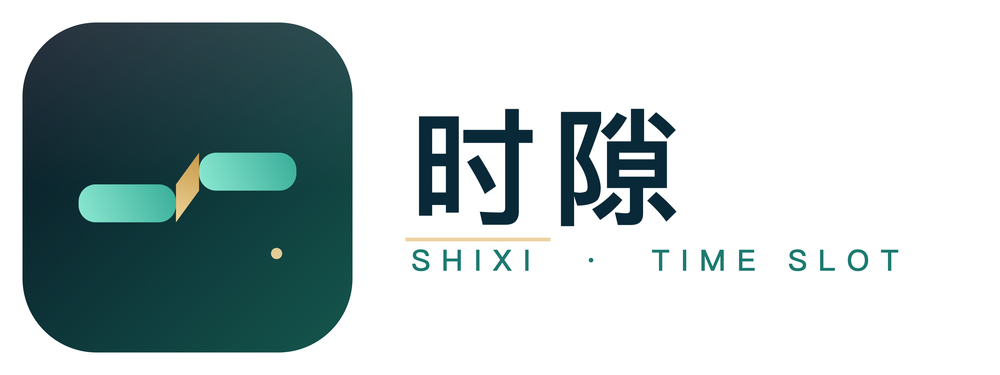
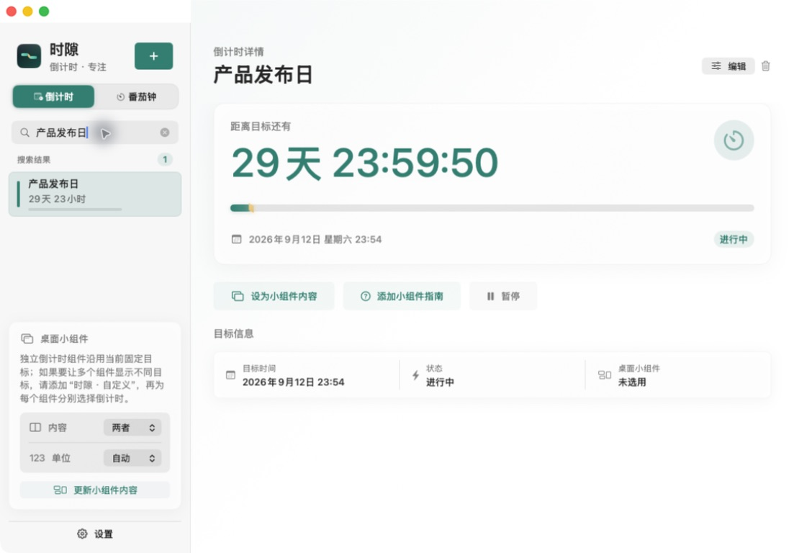
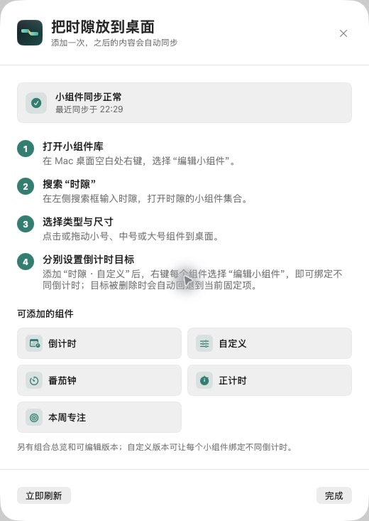

<div align="center">
  

  <h1>时隙 · TimeSlot</h1>

  <p>
    <strong>把重要目标与专注节奏，固定在 Mac 桌面。</strong><br />
    原生 macOS 倒计时 · 番茄钟 · 正计时 · 专注统计 · WidgetKit 小组件
  </p>

  <p>
    <a href="https://github.com/xcj577577-cmd/timeslot/releases/latest">
      
    </a>
    <a href="https://github.com/xcj577577-cmd/timeslot/blob/main/LICENSE">
      
    </a>
    
    
    
  </p>

  <p>
    <a href="https://github.com/xcj577577-cmd/timeslot/releases/latest">下载最新版</a>
    ·
    <a href="https://github.com/xcj577577-cmd/timeslot/releases">查看更新日志</a>
    ·
    <a href="https://github.com/xcj577577-cmd/timeslot/issues">反馈问题</a>
  </p>
</div>

---

<p align="center"><a href="./README_EN.md">English version</a></p>

时隙是一款为 Mac 设计的本地生产力工具：为重要目标建立倒计时，把专注拆成可执行的阶段，再用原生桌面小组件让进度始终在视线范围内。

它不需要账号，不放广告，也不把你的时间记录上传到任何服务器。所有日期边界按北京时间（`Asia/Shanghai`）计算。

## 为什么是时隙

| 目标倒计时 | 专注节奏 |
| --- | --- |
| 为考试、发布、纪念日或任意重要目标设置清晰的终点。 | 番茄钟自动安排专注、短休息与长休息，也可以用正计时自由累计投入。 |

| 桌面小组件 | 本地与安心 |
| --- | --- |
| 组合、倒计时、正计时、番茄钟、本周目标和可配置小组件，支持小、中、大尺寸。 | 无账号、无广告、无第三方分析 SDK；数据只留在 Mac 的 App Sandbox 与 App Group 中。 |

## 核心功能

- **倒计时**：新建、编辑、暂停、继续或删除任意目标，到时发送 macOS 本地通知。
- **番茄钟**：专注、短休息、长休息自动流转，可调整时长与轮次。
- **正计时**：从零开始累计专注时长，停止后按任务写入统计。
- **专注记录**：按全部、今天、近 7 天、本月或自定义日期范围查看趋势与任务分布。
- **安全备份**：导出或导入 JSON；导入前必须先成功创建当前数据的自动备份。
- **可靠升级**：本地存储迁移会先保留旧版快照，规范化成功后才标记迁移完成。
- **系统级体验**：支持通知、提示音、外观、品牌色、减少动态效果与键盘快捷键。

## 小组件，真正留在桌面上

时隙使用 WidgetKit 原生小组件，不是悬浮窗，不会遮挡其他应用。运行中的时间使用系统实时文本显示，关键结束时间写入时间线，实际刷新交给 macOS 管理。

| 小组件 | 用途 |
| --- | --- |
| **时隙 · 自定义** | 每个实例可单独选择跟随应用、倒计时或番茄钟，并绑定不同的倒计时目标。 |
| **时隙 · 倒计时** | 固定显示当前选中的倒计时，适合简单、稳定的桌面展示。 |
| **时隙 · 正计时** | 显示当前自由专注时长。 |
| **时隙 · 番茄钟** | 显示当前阶段、任务和剩余时间。 |
| **时隙 · 本周专注目标** | 查看本周累计专注时长与目标进度。 |
| **时隙桌面小组件** | 在中、大尺寸中组合展示关键状态。 |

## 界面预览

下面是时隙当前版本的真实界面截图。演示图使用中性的“产品发布日”示例数据，不包含个人记录。

<p align="center">
  
</p>

<p align="center"><sub>倒计时工作区：目标、进度、状态与桌面小组件同步集中在一个视图里。</sub></p>

<table>
  <tr>
    <td align="center" width="62%">
      
    </td>
    <td valign="middle">
      <strong>桌面小组件指南</strong><br /><br />
      从小组件库添加时隙，选择倒计时、番茄钟、正计时或本周专注；“自定义”版本还支持为每个实例绑定不同目标。
    </td>
  </tr>
</table>

## 快速开始

### 从 GitHub Release 安装

1. 前往 [Releases](https://github.com/xcj577577-cmd/timeslot/releases/latest) 下载最新 ZIP。
2. 解压后将 `时隙.app` 拖入“应用程序”文件夹。
3. 从“应用程序”中打开一次时隙，让 macOS 注册桌面小组件。
4. 在桌面空白处右键，选择“编辑小组件”，搜索“时隙”并添加。

如果小组件库暂时没有出现“时隙”，请确认应用位于“应用程序”文件夹，退出后重新打开一次，再进入“编辑小组件”。

### 添加多个不同目标的小组件

1. 在时隙中创建或选择倒计时目标。
2. 添加 **时隙 · 自定义** 小组件。
3. 右键每个小组件，选择“编辑小组件”。
4. 在“倒计时目标”中分别绑定目标。

## 快捷键

| 快捷键 | 操作 | 快捷键 | 操作 |
| --- | --- | --- | --- |
| `⌘N` | 新建倒计时 | `⌘F` | 搜索倒计时 |
| `⌘1` | 倒计时页面 | `⌘2` | 番茄钟页面 |
| `⌘,` | 打开设置 | `空格` | 开始或暂停当前计时 |

## 隐私与数据

> **数据属于你。** 时隙不联网、不要求账号、不收集使用分析，不上传、不出售任何个人信息。倒计时、任务、专注记录、偏好设置和小组件状态只保存在本机。

- 通知内容在本机生成，可随时在时隙或系统设置中关闭。
- 导入数据前会先创建本地安全备份；备份失败时不会覆盖当前数据。
- 从“应用程序”删除 App 不一定会删除 App Group 数据，彻底清理方式见[隐私政策](outputs/隐私政策.md)。

完整说明：[`outputs/使用说明.md`](outputs/使用说明.md) · [`outputs/隐私政策.md`](outputs/隐私政策.md)

## 系统要求

- macOS 14 Sonoma 或更新版本
- Apple Silicon 或 Intel Mac
- 通用二进制（Universal 2）

## 从源码构建

```bash
git clone https://github.com/xcj577577-cmd/timeslot.git
cd timeslot

# 打开 Xcode 工程
open CountdownWidget.xcodeproj

# 运行核心逻辑测试
swift test --disable-sandbox

# 执行 Release 构建、双架构、签名、沙盒、App Group、隐私清单与版本校验
./scripts/verify-release.sh /tmp/timeslot-release
```

验证后的应用位于 `/tmp/timeslot-release/Build/Products/Release/时隙.app`。

## 项目结构

```text
Sources/CountdownWidget/   主应用界面、模型、状态、通知与备份
WidgetExtension/           WidgetKit 桌面小组件扩展
Tests/                     核心逻辑测试
AppBundle/                 Info.plist、授权与隐私清单
scripts/                   品牌资产生成与 Release 验证脚本
docs/images/               README 界面演示图
outputs/                   使用说明、隐私政策、品牌资产与发布资料
```

## 当前版本

**v2.2.0 · Build 52** — [查看完整更新说明](outputs/RELEASE-NOTES-v2.2.0.md)

当前发行包使用 Apple Development 证书签名，尚未完成 Apple 公证；首次打开可能出现 macOS 安全提示。面向陌生设备长期分发时，建议改用 Developer ID 签名并完成公证，不要通过移除隔离属性绕过 Gatekeeper。

## 参与贡献

欢迎通过 [GitHub Issues](https://github.com/xcj577577-cmd/timeslot/issues) 反馈问题、提出建议或提交改进。提交代码前，请先运行 `swift test --disable-sandbox`，涉及发行流程时再运行 `./scripts/verify-release.sh`。

## 许可证

本项目使用 [MIT License](LICENSE)。
