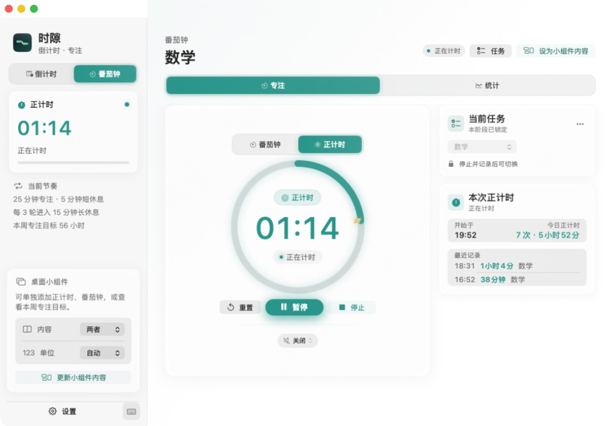

<div align="center">
  

  <h1>TimeSlot</h1>

  <p>
    <strong>Keep important goals and focus rhythms on your Mac desktop.</strong><br />
    Native macOS countdowns · Pomodoro · stopwatch · focus insights · WidgetKit widgets
  </p>

  <p>
    <a href="https://github.com/xcj577577-cmd/timeslot/releases/latest">
      
    </a>
    <a href="https://github.com/xcj577577-cmd/timeslot/blob/main/LICENSE">
      
    </a>
    
    
    
  </p>

  <p>
    <a href="https://github.com/xcj577577-cmd/timeslot/releases/latest">Download latest release</a>
    ·
    <a href="https://github.com/xcj577577-cmd/timeslot/releases">Release notes</a>
    ·
    <a href="https://github.com/xcj577577-cmd/timeslot/issues">Report an issue</a>
  </p>
</div>

---

<p align="center"><a href="./README.md">中文版</a></p>

TimeSlot is a local-first productivity tool for Mac. Set a clear deadline for an important goal, turn focus into executable stages, and keep progress visible with native desktop widgets.

There is no account, no advertising, and no server-side upload of your time records. All date boundaries use Beijing time (`Asia/Shanghai`).

## Why TimeSlot

| Goal countdowns | Focus rhythm |
| --- | --- |
| Set a clear finish line for exams, launches, anniversaries, trips, or any important goal. | Let Pomodoro automatically move through focus, short breaks, and long breaks—or use the stopwatch to track open-ended focus. |

| Desktop widgets | Local and private |
| --- | --- |
| Add combined, countdown, stopwatch, Pomodoro, weekly-goal, and configurable widgets in small, medium, or large sizes. | No account, no ads, and no third-party analytics SDK. Data stays in the Mac App Sandbox and App Group. |

## Core features

- **Countdowns**: Create, edit, pause, resume, or delete any goal. Receive a macOS local notification when it arrives.
- **Pomodoro**: Automatically move through focus, short breaks, and long breaks, with configurable durations and round counts.
- **Stopwatch**: Accumulate focus time from zero and record the session by task when you stop.
- **Focus insights**: Review trends and task distribution across all history, today, the last 7 days, this month, or a custom date range.
- **Safe backups**: Export or import JSON. Before importing, TimeSlot must successfully create a backup of the current data.
- **Reliable upgrades**: Local migrations keep a snapshot of the previous version and only mark migration complete after normalization succeeds.
- **System-level experience**: Notifications, sounds, appearance, accent colors, reduced motion, and keyboard shortcuts are supported.

## Widgets that stay on your desktop

TimeSlot uses native WidgetKit widgets—not floating windows—so they never cover other apps. Running times use the system's live text rendering, important end times are written to the timeline, and macOS manages actual refresh scheduling.

| Widget | Purpose |
| --- | --- |
| **TimeSlot · Custom** | Each instance can follow the app, a countdown, or Pomodoro, and bind to a different countdown target. |
| **TimeSlot · Countdown** | Shows the currently selected countdown for a simple, stable desktop display. |
| **TimeSlot · Stopwatch** | Shows the current open-ended focus duration. |
| **TimeSlot · Pomodoro** | Shows the current phase, task, and remaining time. |
| **TimeSlot · Weekly Focus Goal** | Shows weekly accumulated focus time and goal progress. |
| **TimeSlot desktop widgets** | Combine key status information in medium and large layouts. |

## Interface preview

This is a screenshot from the current release, showing the Pomodoro and stopwatch workspace.

<p align="center">
  
</p>

<p align="center"><sub>Focus workspace: Pomodoro, stopwatch, current task, and session stats in one view.</sub></p>

<table>
  <tr>
    <td align="center" width="62%">
      
    </td>
    <td valign="middle">
      <strong>Desktop widget guide</strong><br /><br />
      Add TimeSlot from the widget gallery, then choose countdown, Pomodoro, stopwatch, or weekly focus. The Custom version can bind a different target to each widget instance.
    </td>
  </tr>
</table>

## Quick start

### Install from a GitHub Release

1. Open [Releases](https://github.com/xcj577577-cmd/timeslot/releases/latest) and download the latest ZIP.
2. Unzip it and drag `时隙.app` into the Applications folder.
3. Open TimeSlot once from Applications so macOS registers its widgets.
4. Right-click an empty area of the desktop, choose **Edit Widgets**, search for `时隙`, and add a widget.

If TimeSlot does not appear in the widget gallery, make sure the app is in Applications, quit and reopen it once, then open **Edit Widgets** again.

### Add widgets with different countdown targets

1. Create or select a countdown target in TimeSlot.
2. Add a **TimeSlot · Custom** widget.
3. Right-click each widget and choose **Edit Widget**.
4. Select a different target under **Countdown Target** for each instance.

## Keyboard shortcuts

| Shortcut | Action | Shortcut | Action |
| --- | --- | --- | --- |
| `⌘N` | New countdown | `⌘F` | Search countdowns |
| `⌘1` | Countdown page | `⌘2` | Pomodoro page |
| `⌘,` | Open Settings | `Space` | Start or pause the current timer |

## Privacy and data

> **Your data belongs to you.** TimeSlot does not connect to the network, require an account, collect usage analytics, or upload or sell personal information. Countdowns, tasks, focus records, preferences, and widget state stay on this Mac.

- Notification content is generated locally and can be disabled in TimeSlot or System Settings.
- A local safety backup is created before importing data; if the backup fails, the current data is not overwritten.
- Removing the app from Applications may not remove its App Group data. For complete cleanup, see the [privacy policy](outputs/隐私政策.md).

Full documentation: [`outputs/使用说明.md`](outputs/使用说明.md) · [`outputs/隐私政策.md`](outputs/隐私政策.md)

## System requirements

- macOS 14 Sonoma or later
- Apple Silicon or Intel Mac
- Universal 2 binary

## Build from source

```bash
git clone https://github.com/xcj577577-cmd/timeslot.git
cd timeslot

# Open the Xcode project
open CountdownWidget.xcodeproj

# Run core logic tests
swift test --disable-sandbox

# Build, sign, validate, and verify the Release package
./scripts/verify-release.sh /tmp/timeslot-release
```

The verified app is placed at `/tmp/timeslot-release/Build/Products/Release/时隙.app`.

## Project structure

```text
Sources/CountdownWidget/   Main app UI, models, state, notifications, and backups
WidgetExtension/           WidgetKit desktop widget extension
Tests/                     Core logic tests
AppBundle/                 Info.plist, entitlements, and privacy manifest
scripts/                   Asset generation and Release verification scripts
docs/images/               README interface screenshots
outputs/                   User guide, privacy policy, and release materials
```

## Current version

**v2.2.0 · Build 52** — [View the full release notes](outputs/RELEASE-NOTES-v2.2.0.md)

The current release is signed with an Apple Development certificate and is not notarized. macOS may show a security warning the first time it opens. For long-term distribution to other Macs, use a Developer ID certificate and complete notarization instead of bypassing Gatekeeper by removing quarantine attributes.

## Gatekeeper feedback and resolution (Issue #1)

Thank you to [@ixhsia](https://github.com/ixhsia) for reporting the “unable to verify” problem and providing reproduction details.

The root cause is that the current GitHub release uses an Apple Development certificate and has not been notarized. That is suitable for local development and testing, but not for distributing an installable app to unfamiliar Macs, so macOS Gatekeeper may show a verification warning.

The proper fix is to sign both the app and its desktop widget with `Developer ID Application`, submit the package to Apple Notary Service, and publish the notarized ZIP/DMG on GitHub. Disabling Gatekeeper or deleting `com.apple.quarantine` only weakens macOS security; it is not the official fix.

Until the notarized build is published, you can test the app on your own Mac by right-clicking `时隙.app` in Finder and choosing **Open**, or by choosing **Open Anyway** in System Settings → Privacy & Security.

The `main` branch also includes the latest functional updates: the white-noise feature has been removed, and Pomodoro statistics now support weekly views and preset weeks.

## Contributing

Use [GitHub Issues](https://github.com/xcj577577-cmd/timeslot/issues) to report bugs, suggest improvements, or discuss contributions. Before submitting code, run `swift test --disable-sandbox`; for release-related changes, also run `./scripts/verify-release.sh`.

## License

This project is licensed under the [MIT License](LICENSE).
